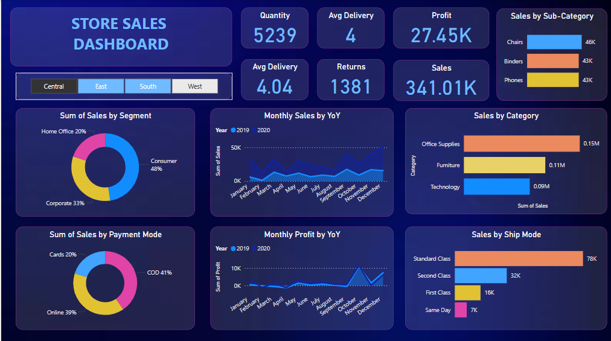

# 🛒 Online Store Dashboard - Power BI  

## 📌 Project Overview  
This Power BI dashboard provides an interactive and visual representation of an online store’s sales performance. It enables users to track key business metrics, analyze sales trends, and make data-driven decisions.  

## 📸 Dashboard Preview  
  

## 📊 Features  
- **Sales Performance Analysis** – Track total revenue, profits, and sales trends over time.  
- **Product & Category Insights** – Identify top-selling products and categories.  
- **Customer Analytics** – Analyze customer demographics and purchase behavior.  
- **Geographical Sales View** – View sales distribution across different regions.  
- **Interactive Filters & Drill-Throughs** – Filter data by date, category, product, and region.  

## 🛠️ Technologies Used  
- **Power BI** – For data visualization and dashboard creation.  
- **SQL** – For data extraction and transformation (if applicable).  
- **Excel/CSV** – Source data files for analysis.  

## 📂 Project Structure  
